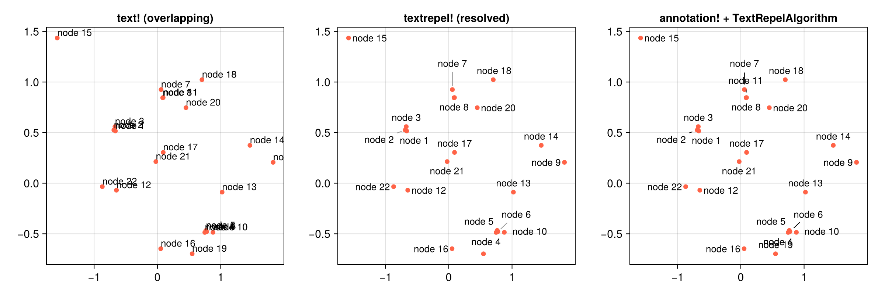

# MakieTextRepel.jl

[](https://github.com/jowch/MakieTextRepel.jl/actions/workflows/CI.yml)

A `ggrepel`/`adjustText`-style label-repel recipe for [Makie](https://docs.makie.org).
Automatically displaces overlapping text labels and draws connector lines back to
their data points.



*Left: plain `text!` labels collide. Middle: `textrepel!` separates them and draws
connectors back to each point. Right: the same solver driving `Makie.annotation!`
through `TextRepelAlgorithm`. (Reproduce with [`examples/readme_example.jl`](examples/readme_example.jl).)*

## Installation

```julia
using Pkg
Pkg.add(url="https://github.com/jowch/MakieTextRepel.jl")
```

Its measurement dependency, [TextMeasure.jl](https://github.com/jowch/TextMeasure.jl),
is in the General registry and resolves automatically. Once MakieTextRepel is itself
registered, `Pkg.add("MakieTextRepel")` will be all you need.

## Usage

```julia
using CairoMakie, MakieTextRepel

fig = Figure()
ax = Axis(fig[1, 1])
pts = Point2f[(1, 1), (1.1, 1.05), (1.05, 0.9)]

# Draw the labels first, then scatter on top, so the connector lines tuck under the
# markers. Pass `markersize` so the labels keep clear of the markers.
textrepel!(ax, pts; text = ["alpha", "beta", "gamma"], markersize = 9)
scatter!(ax, pts; markersize = 9)
fig
```

(Marker clearance is handled by the solver, not by draw order — ordering only decides
whether a connector or a marker sits on top where they overlap.)

Key attributes:

- `only_move` (`:both`/`:x`/`:y`) — constrains which axis labels may move.
- `box_padding` — breathing room around each label box.
- `point_padding` — **marker clearance**: the minimum gap kept between every scatter
  marker and the nearest label text edge, enforced after layout for a label's own
  *and* its neighbours' markers (default 5 px).
- `markersize` — convenience: set it to your `scatter!` marker size and `point_padding`
  is derived as `markersize/2 + 0.5`.
- `min_segment_length` — connector visibility cutoff (shorter leaders are hidden).
- `background` — draw a filled box behind each label; style it with `backgroundcolor`,
  `strokecolor`, `strokewidth`.
- `segments`/`segmentcolor`/`linewidth` — connector line toggle and styling.

The default solver guarantees zero label overlap (to within a sub-pixel tolerance),
keeps labels clear of the markers, and automatically drops labels when a scene is
over-capacity.

> The force-tuning attributes `force`, `force_point`, `force_pull`, `max_iter`, and
> `max_overlaps` are **inert under the default `ProjectionSolver`** (it has no force
> loop and resolves overlaps geometrically); they affect only the non-default in-tree
> force solver.

If a label you wanted is missing, the scene was over-capacity in that region and the
solver dropped it. Give it more room (enlarge the figure, shrink `point_padding`/
`box_padding`, or shorten the label), or check how many were dropped with
`solve_stats` — see [`examples/annotation_advanced.jl`](examples/annotation_advanced.jl).

## How it works

Three layers:

- **measure** — every label's box is sized from its rendered extent via
  [TextMeasure.jl](https://github.com/jowch/TextMeasure.jl), render-free (no `Scene`
  is allocated; plain strings, LaTeX, and Makie rich text are all supported).
  Placement works from real glyph metrics — the same true-extent approach `ggrepel`
  and `adjustText` take — so overlap removal and marker clearance run against the
  actual text box.
- **solve** — a deterministic, zero-overlap projection solver in pixel space: discrete
  side-selection (which side of each point its label takes) → crossing repair → Dykstra
  constraint-projection legalization, with every data anchor treated as a keep-out so
  labels never sit under their markers.
- **render** — text + optional boxes + connectors.

Output is deterministic — same data, same figure.

### Animations

`textrepel!` reuses text measurements across reactive updates. In an animation where
the label text is constant, mutating the anchor positions (e.g. `positions[] = …` each
frame) re-solves placement but does **not** re-measure the text — measurement only
re-runs when `text`, `fontsize`, or `font` changes. See `examples/animation_reuse.jl`.

Like [`ggrepel`](https://ggrepel.slowkow.com/) and
[`adjustText`](https://adjusttext.readthedocs.io/), MakieTextRepel repels overlapping
labels and draws leaders back to each point; unlike them it splits placement into a
discrete side-selection phase and a constraint-projection phase rather than running a
single continuous force loop, which makes it deterministic and gives a zero-overlap
guarantee. For the full pipeline and a point-by-point comparison, see
[`docs/algorithm.md`](docs/algorithm.md).

## Two surfaces

MakieTextRepel exposes two ways to get repelled labels into a plot. Use `textrepel!`
for standalone repelled labels; use `TextRepelAlgorithm` when you are already drawing
with `annotation!` or want its arrow-head / custom-path leader styling.

### `textrepel!`

A standalone Makie recipe with the full feature set: zero-overlap
projection solver, automatic over-capacity dropping, background boxes,
and pixel-space connector trimming.

```julia
using MakieTextRepel
# Labels first, scatter on top (so connectors tuck under the markers).
textrepel!(ax, points; text = labels, only_move = :y, markersize = 9)
scatter!(ax, points; markersize = 9)
```

### `TextRepelAlgorithm`

An algorithm plug-in for `Makie.annotation!`. Reuses the same
zero-overlap solver underneath `annotation!`'s styling
(`Ann.Styles.LineArrow()`, custom paths, arrow heads).

```julia
using MakieTextRepel
# annotation! manages its own leaders, so the usual scatter-first order is fine here.
scatter!(ax, points)
annotation!(ax, points; text = labels,
            algorithm = TextRepelAlgorithm(only_move = :y))
```

Also supports per-label pinning (mix finite and `NaN` entries in
`textpositions_offset`) and obstacle avoidance via the `obstacles`
keyword — see [`examples/annotation_advanced.jl`](examples/annotation_advanced.jl).
